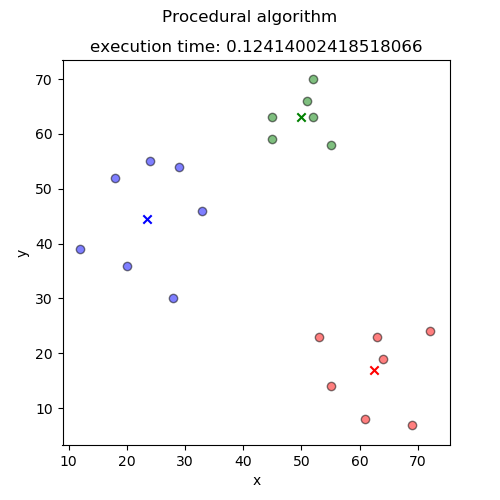
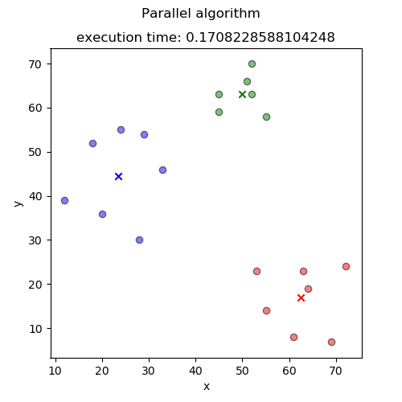
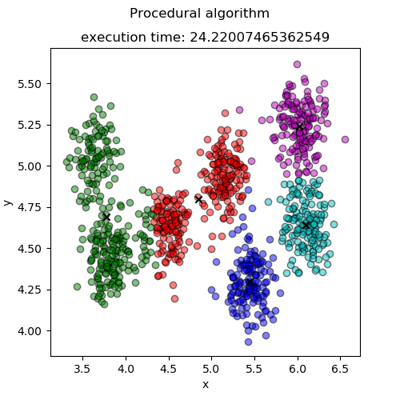
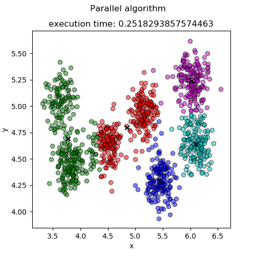

# EsameRetiCalcolatori
K-means algorithm implemented using PyCUDA for the Computer and computer networks exam.

## K-means clustering
K-means clustering is an unsupervised machine learning algoritmh that finds a finite number of groups (called clusters) in an unlabeled dataset.

It consists in three steps:

	1. Initialize
	2. Assignment
	3. Update
	
Iterating steps (2) and (3) we will find optimal centroid's values.
	
#### Initialize
At first, we need centroid's values. A centroid is a point that identify the cluster. The initial value of a centroid can be randomly chosen or, like this example, chosen equals to the first dataset point.

There are k centroid like clusters number.

#### Assignment
This step consists of assigning a dataset point to the most similar centroid and so to a cluster. In this example, we have used the Euclidean distance as assignment criterium.

#### Update
This step calculates the mean values between all the assigned points and uses them to update centroid's values.

## Example

#### Initialize
I parsed the dataset into a pandas dataframe, the easiest way to initialize centroids is simply to use the first k points of the dataset.

```python

self.centroids = np.array(self.df.iloc[:self.k]).astype(np.float32)

```

#### Assignment
For each point of the dataset, I calculated the Euclidean distance with each centroid. Then I assigned the point to the cluster that is nearest.

```python

def assignment(self):
        distance_eucl = np.zeros(self.k) # creates a temporal numpy array 
        for index, row in self.df.iterrows(): # for each row of the dataframe
            for j in range(self.k): # for each cluster
                distance_eucl[j] = np.linalg.norm(row-self.centroids[j]) # calculates euclidean distance between dataset's point and centroid and stores it in the temporal array
            self.final_df.loc[index,'cluster'] = np.argmin(distance_eucl) # assigns the point to the nearest centroid
    
```

#### Update
I calculated the average between all points that are assigned to the same cluster. The result is the new value of the centroid. The optimum is reached when the new value equals to the old one.

```python

def update_centroids(self):
        flag_optimum = False # boolean flag for optimum
        for i in range(self.k): # for each cluster
            mean = np.mean(self.final_df[self.final_df['cluster'] == i]).astype(np.float32) # calculates the average between points that are assigned to the same cluster
            for j in range(self.df.shape[1]):  # for each features
                if(mean[j] == self.centroids[i][j]):    # True if the centroids has no need to be updated
                    flag_optimum = True
                else:
                    flag_optimum = False
                    self.centroids[i][j] = mean[j]  # Updates centroid component values
        return flag_optimum

```

### Parallel approach
I used python's PyCUDA library to parallelize the assignment step. The computation is executed on the GPU.

```c

__global__ void assignment(int *labels, float *features, float *centroids, int *k, int *features_height, int *features_width){
    extern __shared__ float distances[];   //creates a temporal array

	int idx = blockIdx.x * blockDim.x + threadIdx.x;

    for(int i=0; i<*k; i++){    //for each cluster
        float distance_eucl = 0;
        for(int j=0; j<*features_width; j++){   //for each feature
            distance_eucl += pow(features[idx + *features_height * j] - centroids[i + *k * j], 2);    //sums of the squares of the components
        }
        distance_eucl = sqrt(distance_eucl);    //square root of the sum
        if(i==0){
        	distances[idx] = distance_eucl; //stores distance value 
        }
        if(distances[idx] > distance_eucl){ //if the distance stored is less than the calculated distance
            distances[idx] = distance_eucl; //updates distance stored
            labels[idx] = i;    //updates label
        }
    }
    __syncthreads();
}

```

The CUDA kernel is invoked from python.

```python

self.kernel_assign(clusters_gpu, self.features_gpu, centroids_gpu, cuda.In(np.int32(self.k)), cuda.In(np.int32(self.df.shape[0])), cuda.In(np.int32(self.df.shape[1])), block=(self.df.shape[0],1,1), shared=8*self.df.shape[0])

```

## Results

#### Example 1
We can execute the first example with
```

python3 Example1.py

```

Example1 uses a small dataset (just twenty 2D-points). 






As we can see, the execution with the GPU requires more time that the one that use python's NumPy.

#### Example 2
We can execute the first example with
```

python3 Example2.py

```

Example2 uses larger dataset (1000 2D-points).






In this example, we immediately notice that the parallel execution is much faster to reach the optimum that the procedural approach.